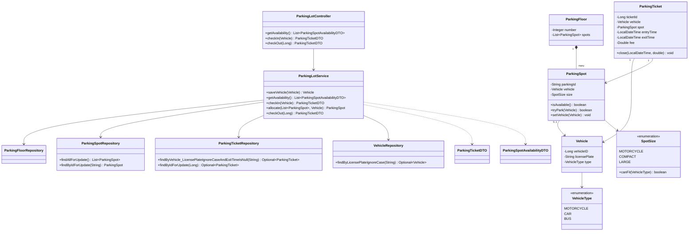

# Smart Parking Lot System

## Project Overview

Smart Parking Lot System is a Spring Boot backend for managing vehicle entry and exit, parking spot allocation, spot availability, and parking fee calculation.

## Features

- Lists all parking spots and their current availability.
- Checks vehicles in and assigns the smallest suitable available spot.
- Prevents a vehicle from having more than one active parking ticket.
- Checks vehicles out and releases their parking spots.
- Calculates fees by vehicle type and billable hour.
- Uses database row locking to coordinate concurrent check-in and check-out operations.
- Seeds a default parking lot at application startup.

## Technology Stack

- Java 17
- Spring Boot 4.1.1
- Spring Web MVC
- Spring Data JPA
- Jakarta Bean Validation
- H2 in-memory database
- Gradle

## Running the Application

On Windows:

```powershell
./gradlew.bat bootRun
```

On macOS or Linux:

```bash
./gradlew bootRun
```

The application starts on `http://localhost:8080`.

The H2 console is available at `http://localhost:8080/h2-console` with the following connection settings:

| Setting | Value |
| --- | --- |
| JDBC URL | `jdbc:h2:mem:SmartParkingLotSystem` |
| User name | `user` |
| Password | `user` |

Because the database is in memory, its data is reset when the application stops.

## REST API

### Get availability

```http
GET /availability
```

Returns every spot with its floor number, spot identifier, size, and availability.

### Check in a vehicle

```http
POST /checkin
Content-Type: application/json
```

Request body:

```json
{
  "licensePlate": "KA01AB1234",
  "type": "CAR"
}
```

The service selects the smallest available spot that can fit the vehicle and returns a parking ticket. Supported vehicle types are `MOTORCYCLE`, `CAR`, and `BUS`.

### Check out a vehicle

```http
POST /checkout?ticketId=1
```

Closes the active ticket, calculates the fee, and releases the assigned spot.

## Business Rules

### Spot sizes

| Spot size | Supported vehicles |
| --- | --- |
| `MOTORCYCLE` | Motorcycles |
| `COMPACT` | Motorcycles and cars |
| `LARGE` | Motorcycles, cars, and buses |

Allocation prefers smaller spots by size order, so a vehicle uses the smallest compatible spot available.

### Hourly rates

| Vehicle type | Rate per hour |
| --- | ---: |
| `MOTORCYCLE` | 15.0 |
| `CAR` | 20.0 |
| `BUS` | 50.0 |

Fees are rounded to two decimal places. Any parking duration less than one hour is billed as one hour, and longer durations are rounded up to the next whole hour.

## Architecture

The application follows a layered architecture:

- **Controller layer**: `ParkingLotController` exposes the REST API and accepts validated request bodies and parameters.
- **Service layer**: `ParkingLotService` coordinates allocation, check-in, check-out, ticket creation, and fee calculation. Transaction boundaries are defined here.
- **Repository layer**: Spring Data JPA repositories persist entities and provide derived queries. Pessimistic write locks protect spot allocation and ticket/spot updates.
- **Entity layer**: JPA entities model floors, spots, vehicles, and parking tickets. Enums represent vehicle types and spot sizes.
- **DTO layer**: DTOs expose ticket and availability data without returning the complete persistence model for every endpoint.
- **Initialization layer**: `DataInitializer` creates four floors and adds two motorcycle, two compact, and two large spots to each floor at startup.
- **Exception handling**: `GlobalExceptionHandler` converts `ParkingException` into HTTP 400 responses containing the exception message.
- **Identifier generation**: `ParkingIdGenerator` creates spot IDs using the floor number, a two-character size prefix, and a sequence number.

## Project Structure

```text
src/
  main/
	java/com/airtribe/SmartParkingLotSystem/
	  SmartParkingLotSystemApplication.java  # Spring Boot entry point
	  controller/                            # REST endpoints
	  dto/                                   # API transfer objects
	  entity/                                # JPA entities and enums
	  exception/                             # Domain exceptions
	  exceptionhandler/                      # Global HTTP error handling
	  generator/                             # Custom parking spot ID generation
	  initializer/                           # Startup data initialization
	  repository/                            # Spring Data JPA repositories
	  service/                               # Application and business logic
	resources/
	  application.properties                 # Server, H2, and JPA configuration
  test/
	java/                                    # Unit and application tests
build.gradle                                 # Gradle build configuration
settings.gradle                              # Gradle project settings
```

## Class Diagram



## Testing

Run the test suite with:

```powershell
./gradlew.bat test
```

or:

```bash
./gradlew test
```
